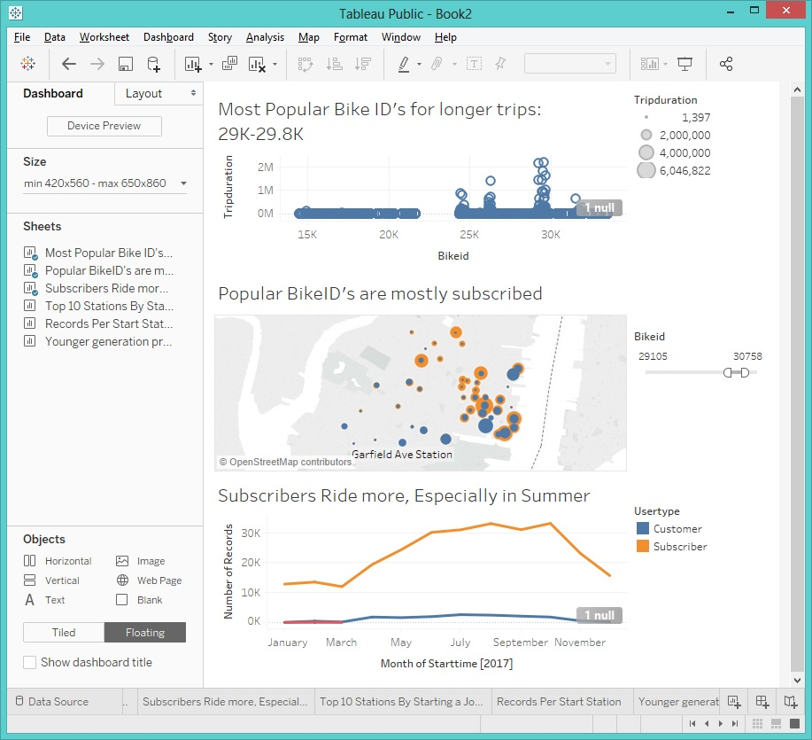

# Tableau - Citi Bike Analytics

## Background

Since 2013, the [New York Citi Bike Program](https://en.wikipedia.org/wiki/Citi_Bike) has implemented a robust infrastructure for collecting data on the program's utilization. Through the team's efforts, each month bike data is collected, organized, and made public on the [Citi Bike Data](https://www.citibikenyc.com/system-data) webpage.
The task is to aggregate the data found in the Citi Bike Trip History Logs to build a data dashboard, story, or report.
Data used: [all logs for 2017](https://s3.amazonaws.com/tripdata/index.html).
 
### Dashboard 1

### Dashboard 2

### Tools used: Excel, Tableau.
